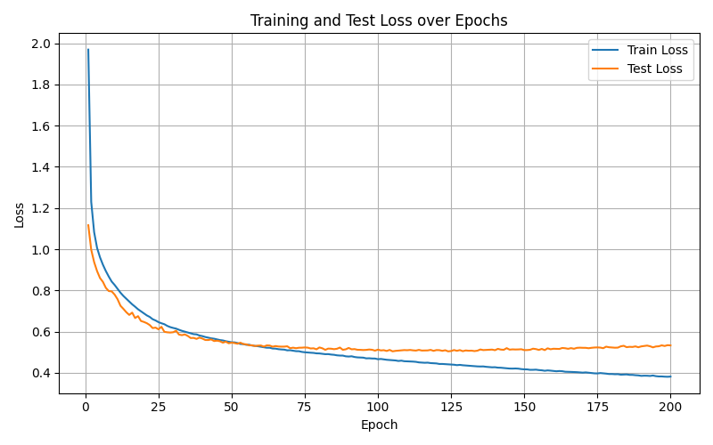
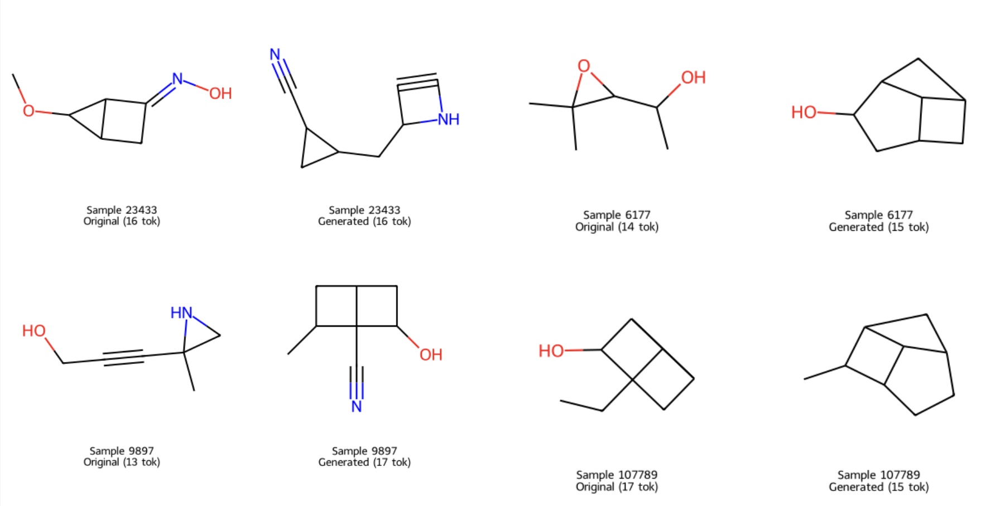
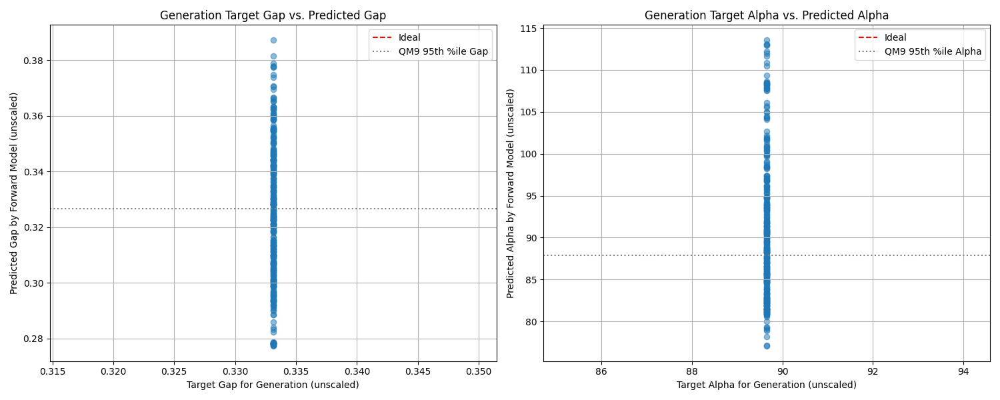

# Machine Learning–Accelerated Design of Self-Assembled Monolayers (SAMs) for Tunneling NEM Switches  
### Colin Weaver • MIT Mechanical Engineering & Nanoelectromechanical Systems

---

## Overview

As CMOS technology reaches its scaling limits, tunneling nanoelectromechanical (NEM) switches have emerged as a promising path toward ultra–low-power electronics. A critical feature of modern tunneling NEM devices is the integration of **self-assembled monolayers (SAMs)**, which allow nanometer-scale gap control and enable quantum tunneling behavior.

However, selecting optimal SAM molecules is difficult due to:  
- high computational cost of DFT  
- slow experimental trial-and-error  
- limited understanding of structure–property relationships  

This project uses **transformer models** (forward + inverse design) to accelerate SAM discovery by predicting key electronic properties and generating new high-performing candidate molecules.

---

## Research Summary

We develop two complementary ML components:

### **1. Forward Transformer Model**
Predicts molecular properties from SMILES:
- HOMO  
- LUMO  
- Energy gap  
- Isotropic polarizability (α)

### Forward Model Training Loss  

  

### Property Prediction Performance (R² Scores)  

  

Achieves:
- **R² = 0.93 for gap**  
- **R² = 0.97 for polarizability**

### **2. Autoregressive Decoder–Only Transformer**
Generates new molecules conditioned on desired properties:
- Produces valid, novel SMILES  
- Preserves structural features  
- Generates **91 new high-performing SAM candidates**

### Inverse Model Training Loss  

  

### Molecule Reconstruction (Known → Predicted)  

  

Together, these models provide a framework for high-throughput SAM exploration for tunneling NEM switches.

---

## Key Results

---

### Performance of Generated Novel Molecules  

  

---

### Top Performing Generated SAM Candidates  

  

---
